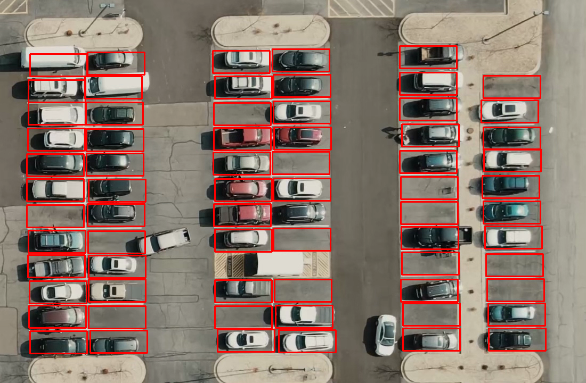
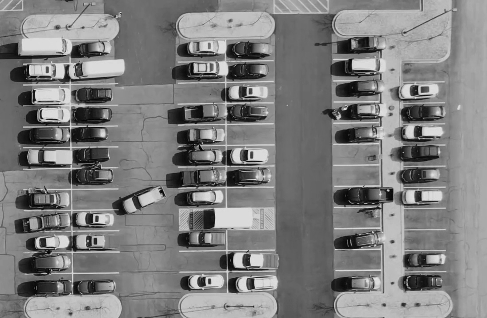
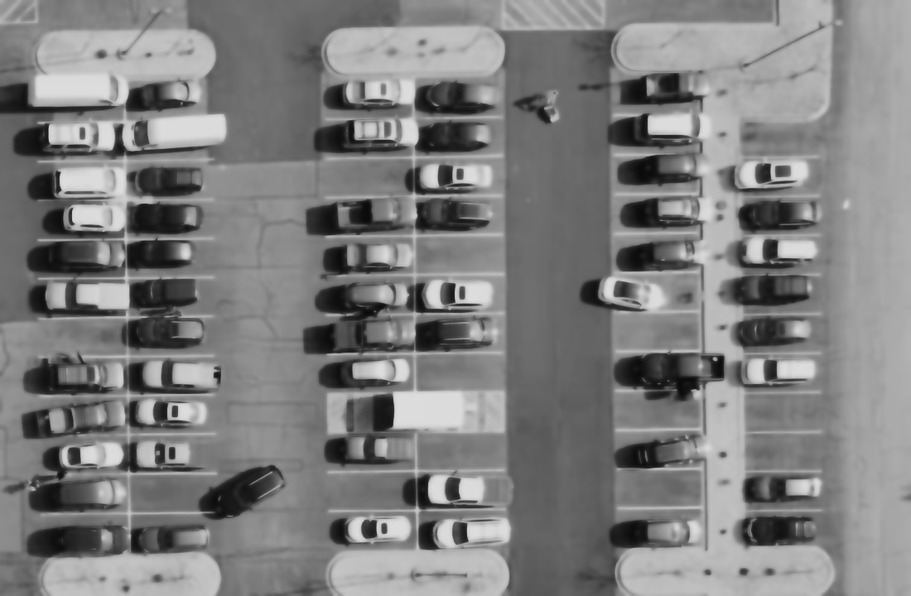
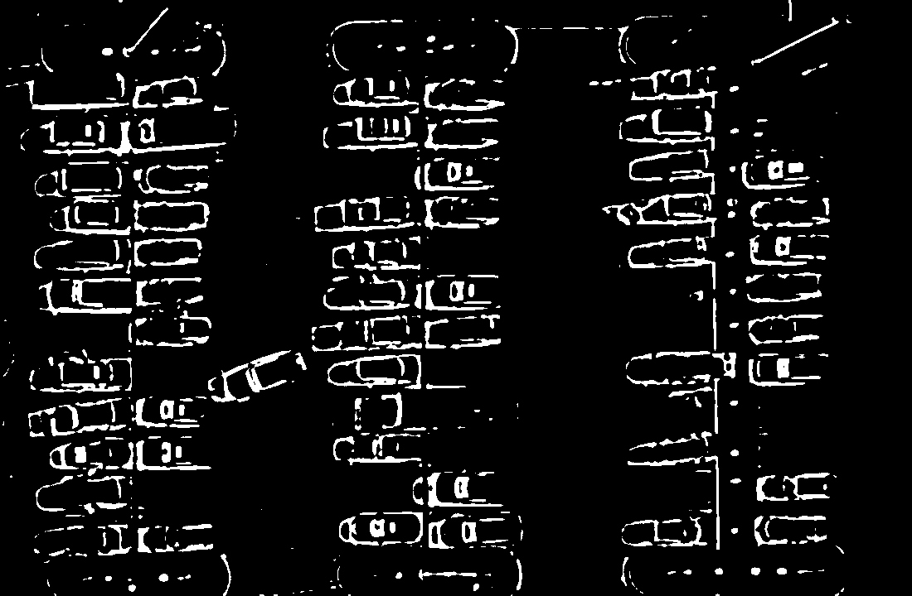
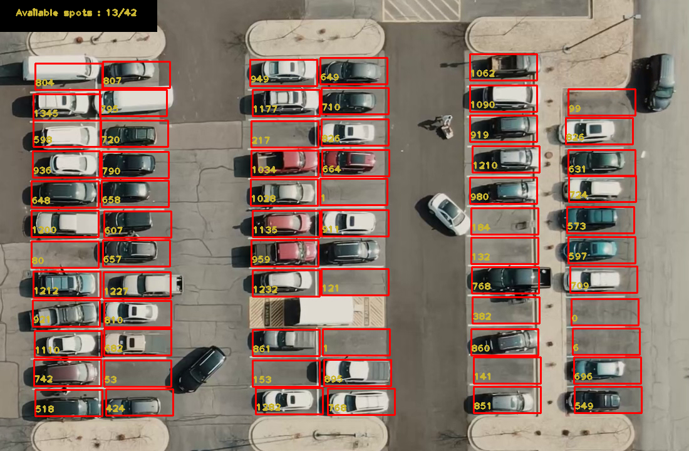

# This repo will represent how to implement couting available parking slots in details.
---
## This apporching requires two main  steps
1. Determine coordinates of each bouding box
2.  Image Processing (blur image, thresholding).
---
- For first step, we use [makesene](https://www.makesense.ai/) to get width and height of a parking slot. After that, we use mouse event to mark parking slots in the image. You will get the result as below

- Turning to Image processing step, the process will be:
   - Step1: Converting color frames into gray frames.
   - Step 2: Blur images by Gaussian Blur
   - Step 3: Apllying threshold on each frame
  
- Outcome:

